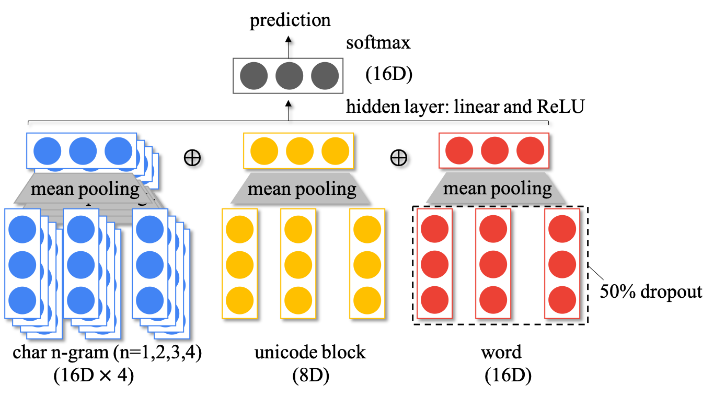

# Language Identification

An simple implementation of language identification (LangID) system.

### Architecture



The model is a feedforward neural network with 3 types of input features:

- char n-gram: extracting character n-grams within each word and then embedding them into vectors through look-up tables. Since it is hard to do word tokenization for some languages and we might even do not know whether a language needs word tokenization (e.g. English v.s Chinese),  the whole sequence is received without word segmentation for extracting the character n-grams  and all the extracted n-grams that contain space are filtered out . To scale the model, two set of vobulary sizes are chosen: 1) 2000, 2000, 12000 and 12000 (labeled as 'sm') and 2) 10000, 10000, 50000 and 50000 (labeled as 'lg').
- unicode block: characters from different languages can fall into different unicode blocks (ranges), and we normalize the counts of all the unicode blocks of the characters to generate features. These normalized counts are then viewed as weights for weighting all the embeddings of unicode blocks. We here use the  external resourse [Unicode Character Ranges](https://www.ling.upenn.edu/courses/Spring_2003/ling538/UnicodeRanges.html) for defining each unicode block, and there are final 122 ones (see [data/unicode-blocks.csv](data/unicode-blocks.csv)).
- word feature: extracting words seperated by space and embedding them into vectors through a look-up table. Although texts from some languages can not be tokenized into words, we apply this tokenization by space anyway, and the failed ones rely on the above two features for LangID.

The detailed dimensions are shown in the bracks in the architecture figure. Adam optimizer with learning rate 1e-3 is adopted. Batch size is 256. Only word feature embeddings are applied with 50% dropout, since the word features are dominant and we would like to mask some of their neurons randomly to force the model learn better char n-gram and unicode block representations. Since the language distribution is unbalanced, we set the loss weight of each language to the nomalized reciprocal of counts powered by 0.1.

### Dataset and external resources

- Training and testing: [sentences from the Tatoeba website](http://downloads.tatoeba.org/exports/sentences.tar.bz2) (statistics: 7967k lines, 66047k words, 440346k characters ). We extract random 10000 examples for validation and testing. We keep the languages whose number of examples > 50 and 212 languages remained. 
- Unicode blocks: from website [Unicode Character Ranges](https://www.ling.upenn.edu/courses/Spring_2003/ling538/UnicodeRanges.html) (see [data/unicode-blocks.csv](data/unicode-blocks.csv)).
- ISO-639-4 look-up table: from wikipedia websites (see [./ISO-639-4.csv](./ISO-639-4.csv)). This look-up table is used to transfer each ISO-639-4 language code to its corresponding label.

### Performance

| Model    | Accuracy  | Precision(macro) | Recall(macro) | F1(macro) | Char/sec | Size/MB |
| -------- | --------- | ---------------- | ------------- | --------- | -------- | ------- |
| fastText | 98.59     | 78.32            | 76.55         | 76.54     | 67k      | 339.3   |
| ffd_sm   | 98.44     | 80.97            | 81.11         | 80.02     | 96k      | **3.1** |
| ffd_lg   | **98.70** | **86.24**        | **85.17**     | **85.17** | **96k**  | 12.2    |

The **fastText** model is trained on the same dataset, using the [official toolkit](https://fasttext.cc/blog/2017/10/02/blog-post.html), and the model is not compressed without quantization techniques. The **ffd_sm** and **ffd_lg** are our models, corresponding to ([mdl/ffd_sm](mdl/ffd_sm), [cache/sm](cache/sm)) and ([mdl/ffd_lg](mdl/ffd_lg), [cache/lg](cache/lg)), respectively. These two models have different vocabulary sizes.

### Dependency

- python=3.6
- pandas=0.25.3
- pytorch=1.3.1
- tqdm=4.40.0
- scikit-leran=0.21.3
- ipython==7.10.1

See also [./requirements.txt](./requirements.txt).

### Project Structure

```bash
.
├── ISO-639-4.csv  # storing mapping between ISO-639-4 language code and label
├── architecture.png 
├── cache # caching objects
│   ├── 1-gram.pkl  # 1-gram feature extractor
│   ├── 2-gram.pkl  # 2-gram feature extractor
│   ├── 3-gram.pkl  # 3-gram feature extractor
│   ├── 4-gram.pkl  # 4-gram feature extractor
│   ├── lang.pkl  # mapping between language code and index
│   ├── unicode-block.pkl  # unicode block feature extractor 
│   └── word.pkl  # word feature extractor
├── crash_on_ipy.py
├── data
│   ├── input.txt  # example of input for predict.py
│   ├── test.csv  # test data
│   ├── unicode_blocks.csv  # defining unicode blocks (ranges)
│   └── valid.csv  # validation data
├── dataset.py  # including loading data, feature extracting and batch building
├── eval.py  # evaluation script
├── ffd.py  # model definition
├── interactive.py  # interaction with command line
├── macros.py  # defining macros
├── mdl  # storing model files
│   └── ffd-googledrop-256hdim
│       ├── args.pkl
│       └── mdl.pkl
├── predict.py  # predication script
├── readme.md  # this file
├── requirements.txt  # conda environment
├── train.py  # training script
└── utils.py
```

### Usage

This repo includes a trained model, namely [mdl/ffd-googledrop-256hdim](mdl/ffd-googledrop-256hdim). One can run these following command lines directly without training.

**Evaluation**:

```shell
python eval.py -ftest data/test.csv -mdir mdl/ffd-googledrop-256hdim -gpu -1 -bsz 256
```

**Predict from file input**:

```shell
python predict.py -finput data/input.txt -mdir mdl/ffd-googledrop-256hdim -gpu -1 -bsz 256
```

Each line in the input file indicated by -finput contains an input example.

**Interact with command line**:

```shell
python interactive.py -gpu -1
```

Or, one can train a new model by the following command.

**Train**: 

```bash
python train.py -gpu -1 -ftrain data/train.csv -fvalid data/valid.csv -ftest data/test.csv -mdir mdl/new_model_dir_name -nepoches 4
```

Model files and validation results will be saved in the directory indicated by -midr (mdl/ffd in this cae). Built feature extractors and extracted features will be saved to [./cache](./cache) directory.  The -gpu option indicates the gpu index for training, and should be set to -1 for using cpu. 

#### Reference

- [Yuan Zhang](https://dblp.org/pers/hd/z/Zhang:Yuan), [Jason Riesa](https://dblp.org/pers/hd/r/Riesa:Jason), [Daniel Gillick](https://dblp.org/pers/hd/g/Gillick:Daniel), [Anton Bakalov](https://dblp.org/pers/hd/b/Bakalov:Anton), [Jason Baldridge](https://dblp.org/pers/hd/b/Baldridge:Jason), [David Weiss](https://dblp.org/pers/hd/w/Weiss:David):
  **A Fast, Compact, Accurate Model for Language Identification of Codemixed Text.** [EMNLP 2018](https://dblp.org/db/conf/emnlp/emnlp2018.html#ZhangRGBBW18): 328-337
- [fastText's application for language identification](https://fasttext.cc/blog/2017/10/02/blog-post.html)
- [Tommi Jauhiainen](https://dblp.org/pers/hd/j/Jauhiainen:Tommi), [Marco Lui](https://dblp.org/pers/hd/l/Lui:Marco), [Marcos Zampieri](https://dblp.org/pers/hd/z/Zampieri:Marcos), [Timothy Baldwin](https://dblp.org/pers/hd/b/Baldwin:Timothy), [Krister Lindén](https://dblp.org/pers/hd/l/Lind=eacute=n:Krister):
  **Automatic Language Identification in Texts: A Survey.** [J. Artif. Intell. Res. 65](https://dblp.org/db/journals/jair/jair65.html#JauhiainenLZBL19): 675-782 (2019)


